# kafka-apm-example


Example of APM for Kafka


# Architecture of collect

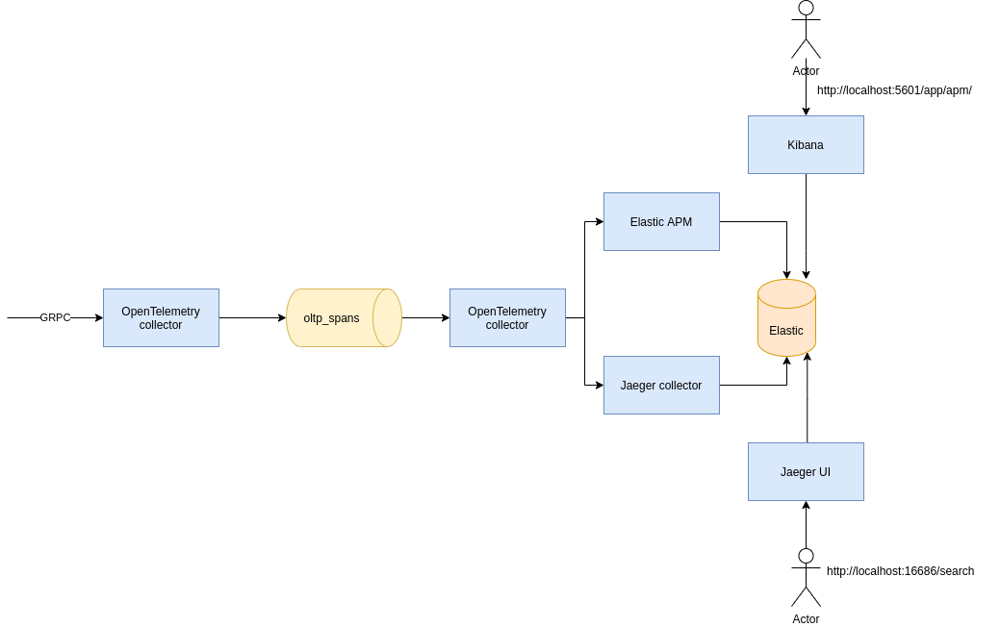

Trace are sent by [OpenTelemetry Java Agent](https://github.com/open-telemetry/opentelemetry-java-instrumentation) 
into an [OpenTemetry collector](https://github.com/open-telemetry/opentelemetry-collector).
The collector send traces inside a Kafka topic named _otlp_spans_.
You can see this topic with AKHQ at [http://localhost:8080/ui/docker-kafka-server/topic/oltp_spans/data](http://localhost:8080/ui/docker-kafka-server/topic/oltp_spans/data).

Then a second OpenTelemetry collector consumes the trace from Kafka and send them inside two different tools.
* One is the [Elastic APM](https://www.elastic.co/fr/apm). You can find the result at [http://localhost:5601/app/apm/services?rangeFrom=now-15m&rangeTo=now](http://localhost:5601/app/apm/services?rangeFrom=now-15m&rangeTo=now)
* The other is [Jaeger](https://www.jaegertracing.io/). You can find the result at [http://localhost:16686/search](http://localhost:16686/search).

# Test with simple kafka producer/consumer

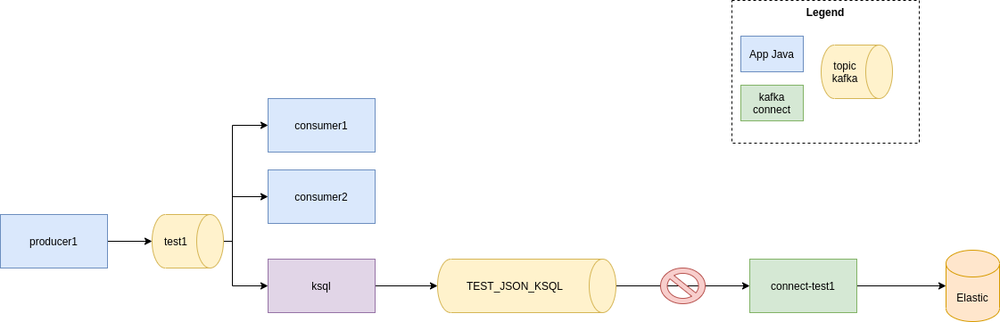

In this first test, a Kafka producer sends traces inside a topic named _test1_ and 2 consumers consume the traces.

A stateless KSQL query consumes also the same topic
```sql
CREATE STREAM json(id VARCHAR) WITH(VALUE_FORMAT='DELIMITED', KAFKA_TOPIC='test1');
CREATE STREAM test_json_ksql WITH(VALUE_FORMAT='json') AS SELECT * FROM json;
```
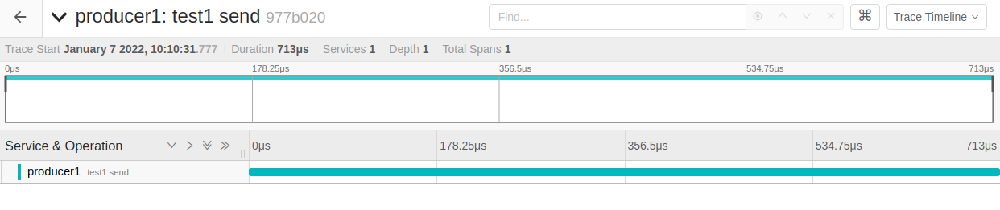

With Jaeger, we can trace the records between producer and consumer.
However, the trace is lost after the KSQL process.

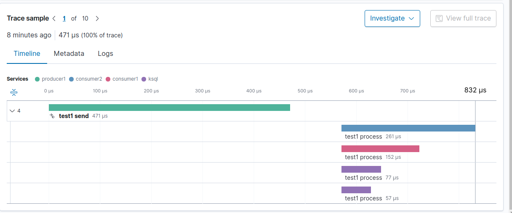

We have the same with elastic.

# Test with API


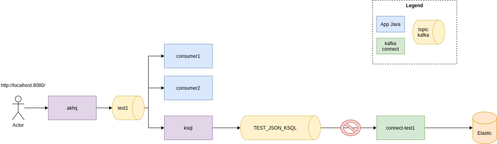

In this example, the kafka's records are sent with a REST API.
The consumption is the same as previous example.

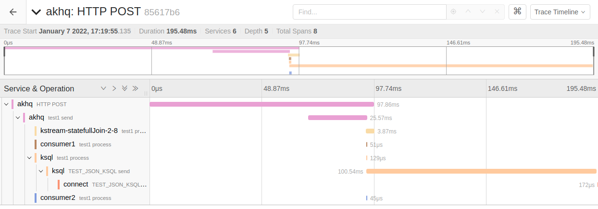

With Jaeger, we see the trace between the POST REST api call and the production into kafka topic.

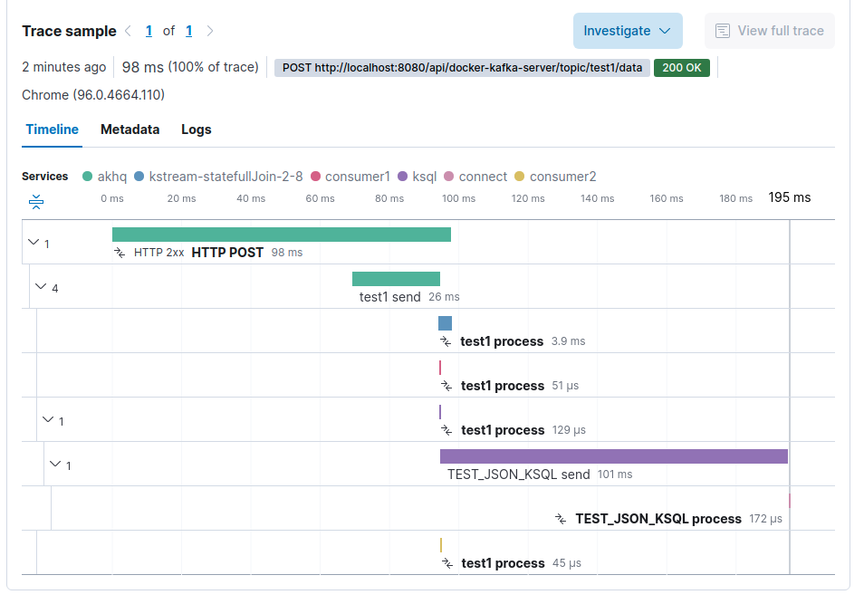

The same with elastic.

# Test with a stateless kstream

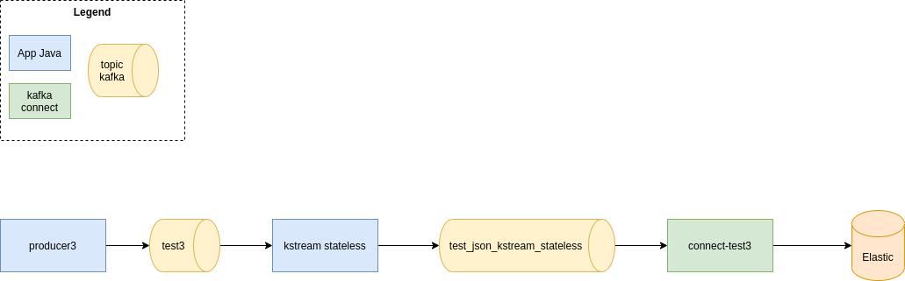

A Producer sends traces inside a Kafka topic named _test3_.
A stateless kafka kstream (a simple _map_) convert the string record into json record and produces them inside a topic named _test_json_kstream_stateless_.
A kafka connect (connector Elasticsearch) consumes this topic and send records inside Elasticsearch.

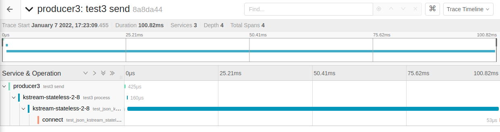

With Jaeger, we follow the traces through the kafka stream.
We can also see the consumption by kafka connect.
However, we cannot see the indexation inside Elasticsearch.

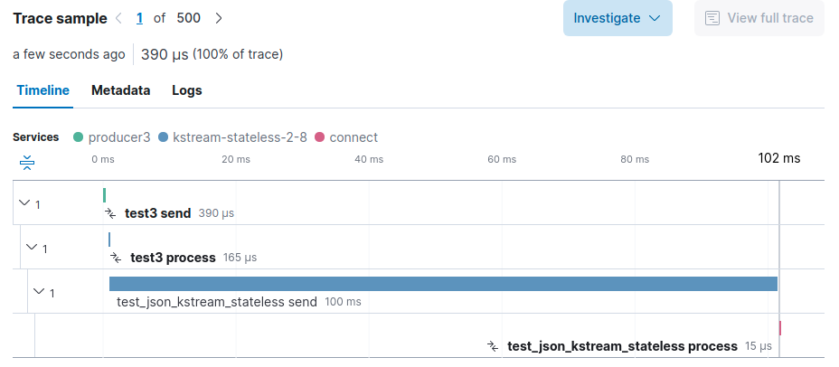

The same with elastic.

# Test with a statefull (join) kstream

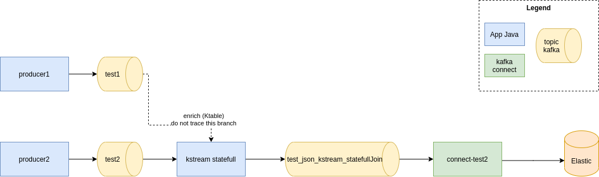

A Producer1 sends traces inside a Kafka topic named _test1_.
A second Producer2 sends traces inside a Kafka topic named _test2_.

A statefull kafka kstream joins the topic _test2_ (a KStream) with the _topic1_ (a KTable).
The result is produced into a topic named _test_json_kstream_statefullJoin_.
A kafka connect (connector Elasticsearch) consumes this topic and send records inside Elasticsearch.

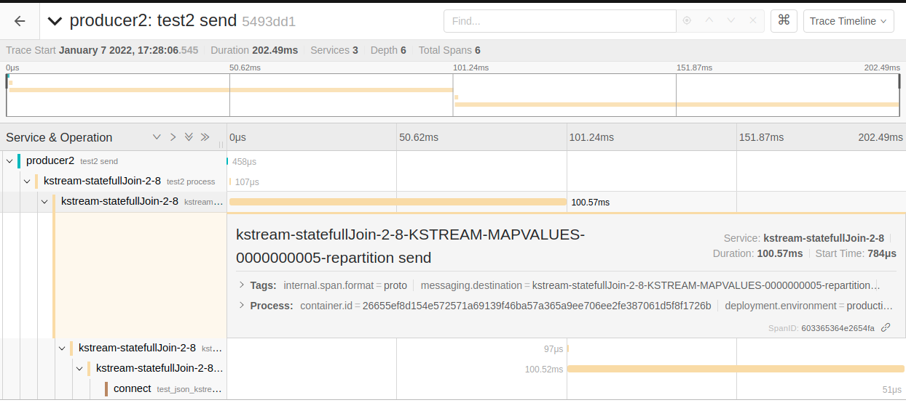

With Jaeger, we follow the traces that come from _topic2_ through the kafka stream topology.
We can also see the consumption by kafka connect.
However, we cannot see the indexation inside Elasticsearch.

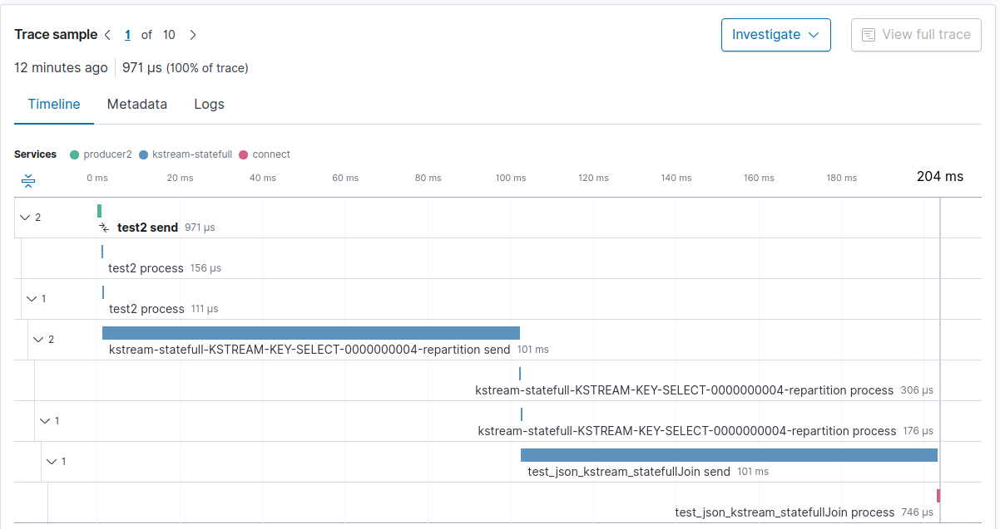

The same with elastic.

# Test with angular front

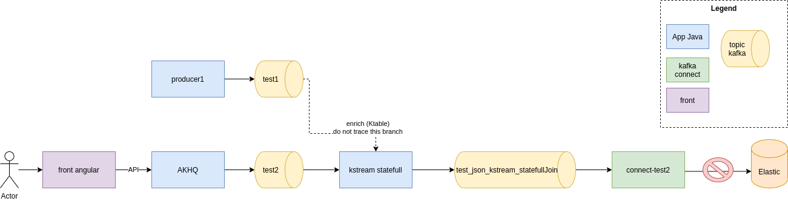

A Producer1 sends traces inside a Kafka topic named _test1_.
A user uses the front [http://localhost:4200](http://localhost:4200) to call a [AKHQ](http://localhost:8080) API that produce message into Kafka topic named _test2_.

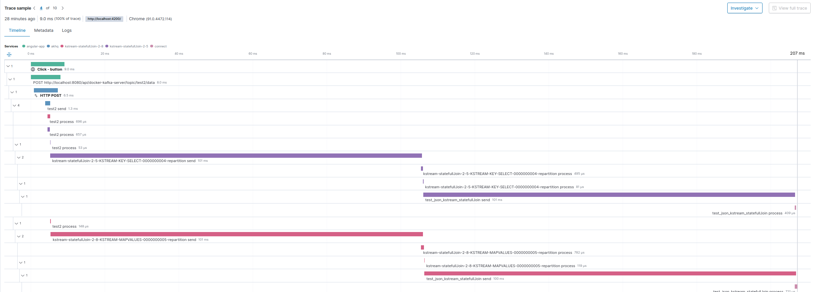

We can see the full trace from the front to kafka connect.
We can also link with the log produce in the backend.

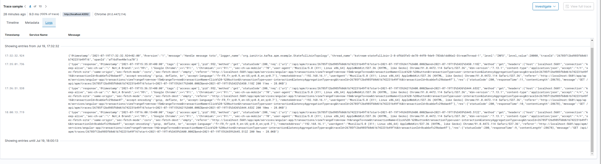

And the real user experience

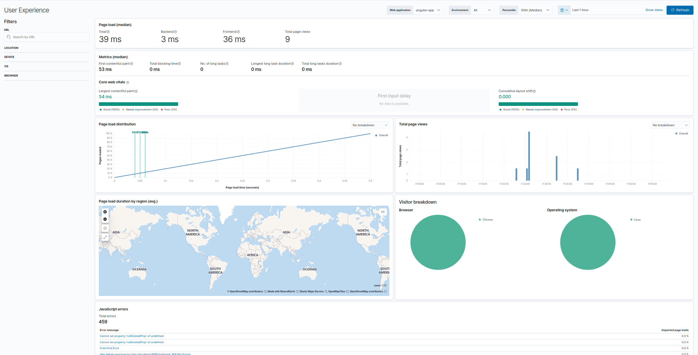

