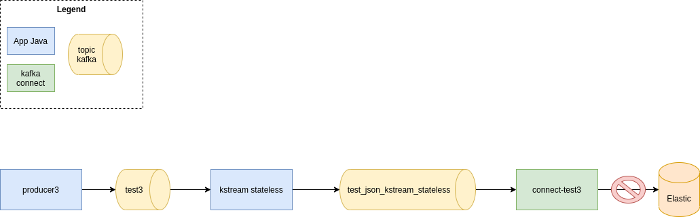
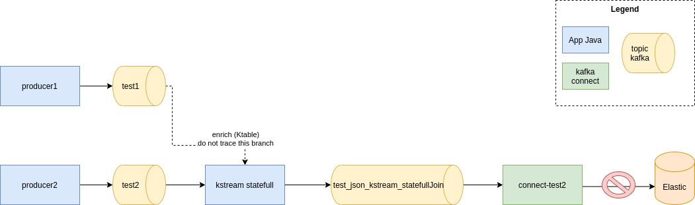
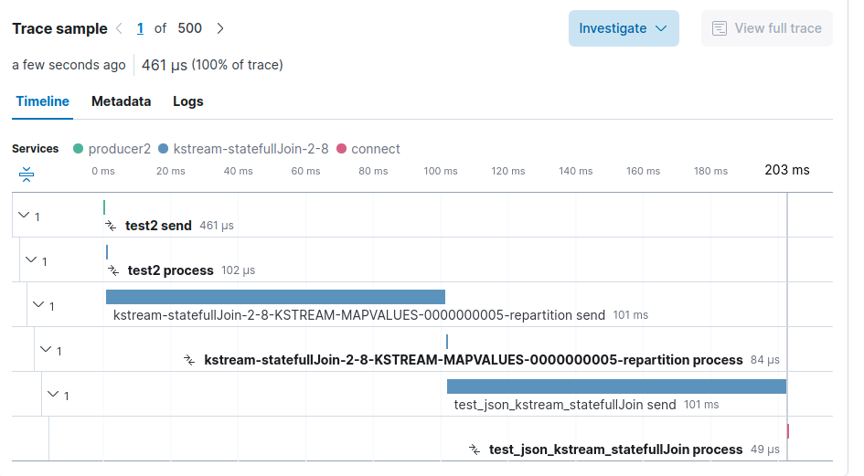
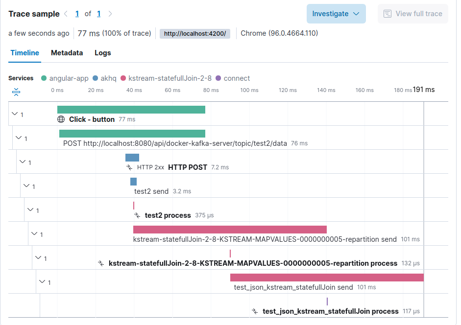

# kafka-apm-example


Example of APM for Kafka

> Use version **1.9.1** of OpenTelemetry agent.

You need to had the Java option *-Dotel.instrumentation.common.experimental.suppress-messaging-receive-spans=true* (see [github issue](https://github.com/open-telemetry/opentelemetry-java-instrumentation/discussions/4509))


# Architecture of collect


Trace are sent by [OpenTelemetry Java Agent](https://github.com/open-telemetry/opentelemetry-java-instrumentation)
into an [OpenTemetry collector](https://github.com/open-telemetry/opentelemetry-collector).
The collector send traces inside a Kafka topic named _otlp_spans_.
You can see this topic with AKHQ at [http://localhost:8080/ui/docker-kafka-server/topic/oltp_spans/data](http://localhost:8080/ui/docker-kafka-server/topic/oltp_spans/data).

Then a second OpenTelemetry collector consumes the trace from Kafka and send them inside Elasticsearch.
* [Elastic APM](https://www.elastic.co/fr/apm). You can find the result at [http://localhost:5601/app/apm/services?rangeFrom=now-15m&rangeTo=now](http://localhost:5601/app/apm/services?rangeFrom=now-15m&rangeTo=now)


# Test with simple kafka producer/consumer


In this first test, a Kafka producer sends traces inside a topic named _test1_ and 2 consumers consume the traces.

A stateless KSQL query consumes also the same topic
```sql
CREATE STREAM json(id VARCHAR) WITH(VALUE_FORMAT='DELIMITED', KAFKA_TOPIC='test1');
CREATE STREAM test_json_ksql WITH(VALUE_FORMAT='json') AS SELECT * FROM json;
```


We can trace the records between producer and consumer.
We also have the trace after the KSQL process (there were lost with the otel agent in version 1.5.3).


# Test with API


In this example, the kafka's records are sent with a REST API.
The consumption is the same as previous example.


We see the trace between the POST REST api call and the production into kafka topic.


# Test with a stateless kstream



A Producer sends traces inside a Kafka topic named _test3_.
A stateless kafka kstream (a simple _map_) convert the string record into json record and produces them inside a topic named _test_json_kstream_stateless_.
A kafka connect (connector Elasticsearch) consumes this topic and send records inside Elasticsearch.


We follow the traces through the kafka stream.
We can also see the consumption by kafka connect.
However, we cannot see the indexation inside Elasticsearch.

# Test with a statefull (join) kstream



A Producer1 sends traces inside a Kafka topic named _test1_.
A second Producer2 sends traces inside a Kafka topic named _test2_.

A statefull kafka kstream joins the topic _test2_ (a KStream) with the _topic1_ (a KTable).
The result is produced into a topic named _test_json_kstream_statefullJoin_.
A kafka connect (connector Elasticsearch) consumes this topic and send records inside Elasticsearch.



We follow the traces that come from _topic2_ through the kafka stream topology.
We can also see the consumption by kafka connect.
However, we cannot see the indexation inside Elasticsearch.

# Test with angular front


A Producer1 sends traces inside a Kafka topic named _test1_.
A user uses the front [http://localhost:4200](http://localhost:4200) to call a [AKHQ](http://localhost:8080) API that produce message into Kafka topic named _test2_.



We can see the full trace from the front to kafka connect.
We can also link with the log produce in the backend.


And the real user experience


# Join Invoice and Payment

In a topic _document_ create records as:

For Invoice
```json
{"clientId": "123", "documentId": "i1", "type":"invoice"}
```

For Payment
```json
{"clientId": "123", "documentId": "p1", "type":"payment"}
```
