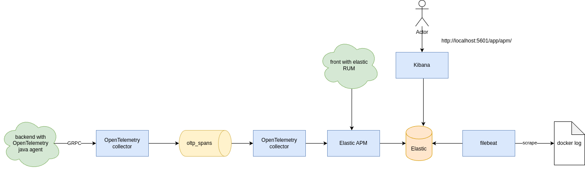
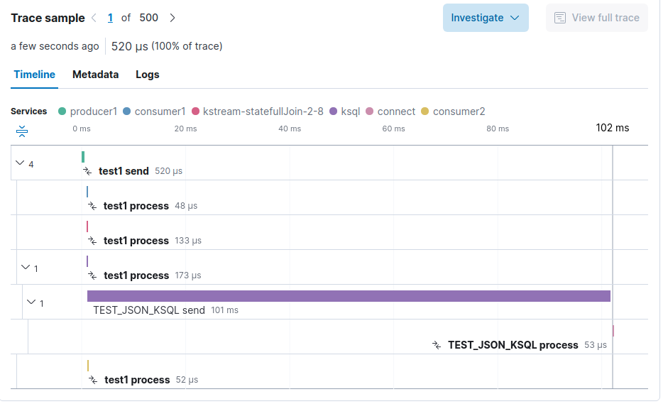

# kafka-apm-example


Example of APM for Kafka

> Use version **1.9.1** of OpenTelemetry agent


# Architecture of collect



Trace are sent by [OpenTelemetry Java Agent](https://github.com/open-telemetry/opentelemetry-java-instrumentation) 
into an [OpenTemetry collector](https://github.com/open-telemetry/opentelemetry-collector).
The collector send traces inside a Kafka topic named _otlp_spans_.
You can see this topic with AKHQ at [http://localhost:8080/ui/docker-kafka-server/topic/oltp_spans/data](http://localhost:8080/ui/docker-kafka-server/topic/oltp_spans/data).

Then a second OpenTelemetry collector consumes the trace from Kafka and send them inside two different tools.
* One is the [Elastic APM](https://www.elastic.co/fr/apm). You can find the result at [http://localhost:5601/app/apm/services?rangeFrom=now-15m&rangeTo=now](http://localhost:5601/app/apm/services?rangeFrom=now-15m&rangeTo=now)
* The other is [Jaeger](https://www.jaegertracing.io/). You can find the result at [http://localhost:16686/search](http://localhost:16686/search).

# Test with simple kafka producer/consumer


In this first test, a Kafka producer sends traces inside a topic named _test1_ and 2 consumers consume the traces.

A stateless KSQL query consumes also the same topic
```sql
CREATE STREAM json(id VARCHAR) WITH(VALUE_FORMAT='DELIMITED', KAFKA_TOPIC='test1');
CREATE STREAM test_json_ksql WITH(VALUE_FORMAT='json') AS SELECT * FROM json;
```


With Jaeger, we can trace the records between producer and consumer.
However, the trace is lost after the KSQL process.



We have the same with elastic.
